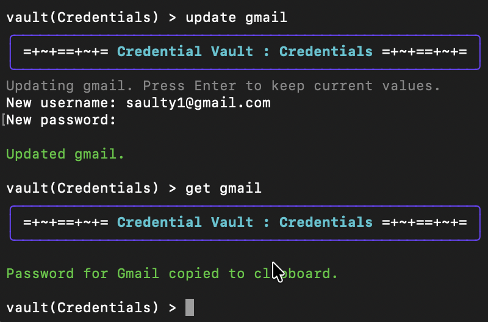
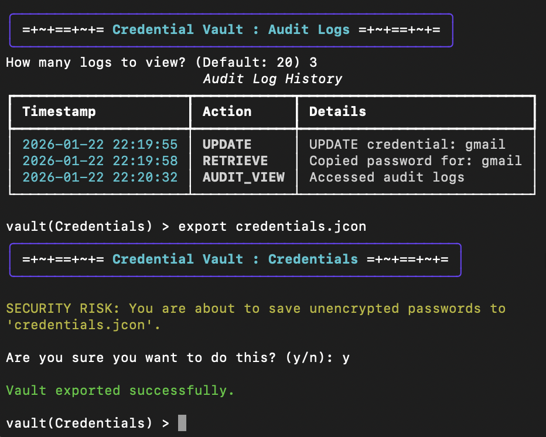

# Credential Vault

A local first **Command Line Interface Password Manager** built in Python. Designed as a digital vault for sensitive credentials. It started as a simple JSON-based password manager and evolved step by step into a vault with AES encryption and a master password system.  


## Table of Contents
- [Download & Run](#download--run)
- [Usage Guide](#usage-guide)
- [Features](#features)
- [Project Roadmap](#project-roadmap)
- [Security](#security)
- [Technical Architecture](#technical-architecture)
- [Tech Stack](#tech-stack)

---

## Download & Run (No Python Required)

You do not need to install Python to use this. You can download the standalone application for Mac (Silicon/M-Series).

1.  **[Download the latest release here](https://github.com/Better-Code-Saul-E/Credential_Vault/releases/latest)**
2.  Open your **Terminal** and go to your downloads:
    ```bash
    cd ~/Downloads
    ```
3.  Make the file executable and run it:
    ```bash
    chmod +x CredentialVault_Mac_v1.0.1
    ./CredentialVault_Mac_v1.0.1
    ```

> **Note:** On the first run, macOS may block the app because it isn't signed. Go to **System Settings > Privacy & Security** and click **"Allow Anyway"** or **"Open Anyway"**.

---

## Usage Guide

Once inside the application, you can use the following commands to manage your credentials:

| Command | Description |
| :--- | :--- |
| `add [name]` | Add a new credential. Prompts for username and secure password. |
| `get [name]` | Retrieve a password. **Automatically copies to your clipboard.** |
| `search [query]` | Fuzzy search for a service (e.g., "netlfix" finds "Netflix"). |
| `view` | List all stored services in the current vault. |
| `update [name]` | Update the username or password for an existing service. |
| `delete [name]` | Permanently remove a credential. |
| `generate` | Generate a cryptographically strong, random password. |
| `audit` | View the  security audit log (login attempts, access history). |
| `switch [name]` | Switch to a different vault (e.g., `work`, `personal`). |
| `passwd` | Change your Master Password (re-encrypts the entire vault). |
| `export` | Export vault to JSON (**Warning:** Unencrypted backup). |
| `import` | Import credentials from a JSON backup file. |
| `help` | Show this list of commands. |
| `exit` | Lock the vault and close the application. |



---

## Features
- **AES Encryption (Fernet)**: AES-128 + HMAC authentication via the Fernet standard.
- **Session Management**: Supports both "One-Shot" commands and an "Interactive Shell" to reduce repeated password entry.
- **Multi-Vault Support**: Switch between separate vaults (e.g., Default, Work, Personal) to organize credentials.
- **Secure Authentication**: PBKDF2-HMAC-SHA256 salted hashing to verify the master password without storing it.
- **Smart Search**: Includes **Fuzzy Search** to find services even if you make a typo (e.g., "netlfix").
- **Password Generator**: Built-in tool to generate cryptographically strong passwords.
- **Audit Logging**: Tracks access events (login, access, failure) locally for security auditing.
- **Smart Utilities**:
  - Clipboard Integration for easy password pasting
  - Password Strength Analyzer evaluating complexity (length, special chars, etc.)
  - Import/Export via Unencrypted JSON backups (with warnings)



---

## Project Roadmap 

This project was built in stages to simulate the lifecycle of growing software complexity.

### Mark 1: The Basics 
- [x] Add/View/Delete credentials (username + password).
- [x] Store data in local JSON (initially unencrypted).

### Mark 2: CLI Fundamentals 
- [x] Implement `argparse` for flags like `--add`, `--get`.
- [x] Create simple text-based menus.
- [x] Robust file organization (auto-creating data files).

### Mark 3: Security Basics
- [x] Implement hashing for master password verification.
- [x] Enforce authentication before accessing data.

### Mark 4: Strong Encryption
- [x] **AES Encryption (Fernet)** implemented via `cryptography`.
- [x] Credentials stored in fully encrypted binary files.
- [x] Rich terminal UI (tables, panels) using `rich` library.

### Mark 5: Advanced CLI
- [x] Git-style subcommands (`vault add`, `vault search`).
- [x] Fuzzy search logic for better UX.
- [x] Secure Import/Export functionality.

### Mark 6: Pro Features
- [x] **Multi-Vault Support** (Context switching between Work/Personal).
- [x] **Clipboard Integration** (Auto-copy passwords).
- [x] Password Strength Analyzer.

### Mark 7: Enterprise Logic
- [x] **Interactive Shell** (`shlex`) for session management.
- [x] **Audit Logging** system.
- [x] **Auto-Logout** timer for security.

---

## Security
- **Zero-Knowledge Architecture**: The app never stores or sees your master password, only the hash.
- **Salted Hashing**: Unique, random salt for every password to prevent Rainbow Table attacks.
- **Local-Only Storage**: All vault data remains on your device; nothing is transmitted.
- **Explicit Warnings**: Dangerous actions trigger confirmation prompts (e.g., exporting unencrypted data or using weak passwords).

---

## Technical Architecture
The project follows lightweight **MVC Principles** for clean separation of concerns:
- **Models**: Data structures (e.g., Credential objects)
- **Views**: Terminal UI using [Rich](https://github.com/Textualize/rich) for tables, panels, and colored text
- **Controllers**: Coordinate between Views and Services/Repositories
- **Services**: Handle business logic (VaultService, AuthService)
- **Repositories**: Persist encrypted JSON data

---

## Tech Stack
- **Language**: Python 3.10+
- **Cryptography**: `cryptography` library (Fernet/PBKDF2)
- **UI/UX**: `rich` (Terminal formatting), `shlex` (Command parsing)
- **System**: `pyperclip` (Clipboard management), `argparse` (CLI arguments)

